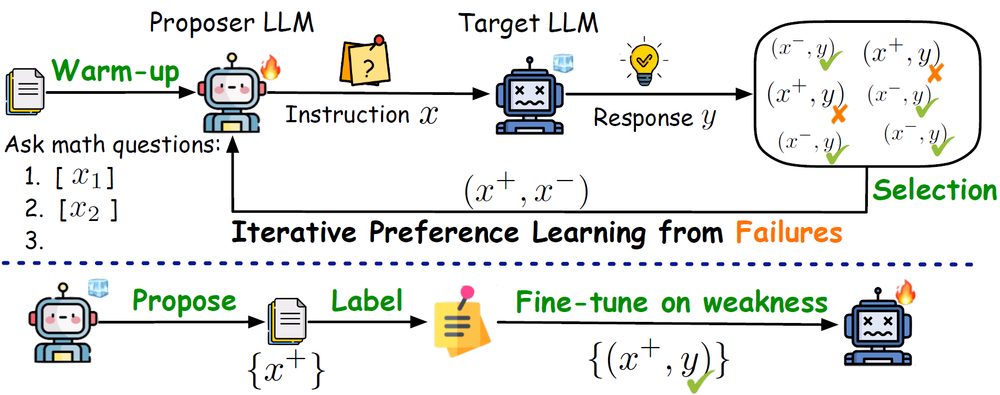

# Failure-inducing Data Synthesis (ReverseGen)
This repository contains the code and released models for our paper [Forewarned is Forearmed: Leveraging LLMs for Data Synthesis through Failure-Inducing Exploration](https://arxiv.org/abs/). 
We propose a new paradigm for generating effective synthetic data from the "failure" cases of a target model on specific tasks.
This approach effectively investigates the target model's weaknesses without the need for human annotation, transforming the task of exploring effective training data tailored to specific models and tasks into a trainable framework centered around failure-inducing exploration. 
We comprehensively evaluate ReverseGen in scenarios such as safety red-teaming, honesty calibration, and mathematical reasoning. Experimental results indicate that ReverseGen can identify a wide range of test samples where target models may fail.

</img>

[](https://arxiv.org/pdf/2410.16736)


## 🔗 Quick Links
- [ReverseGen](#failure-inducing-data-synthesis)
  - [Quickstart](#quickstart)
  - [Training scripts](#training-scripts)
  - [Evaluation](#evaluation)
  - [Bugs or Questions?](#bugs-or-questions)
  - [Citation](#citation)

## Quickstart


### Environment

First, create and activate the conda environment.

```bash
conda env create -f environment.yml
conda activate reversegen
```

You can also manually install dependencies by doing

 ```bash
conda create -n reversegen python=3.10.12
pip3 install numpy==1.24.3 ninja==1.11.1.1 packaging==23.1 
conda install pytorch==2.1.1 pytorch-cuda=12.1 -c pytorch -c nvidia
pip3 install flash-attn==2.3.3
pip3 install transformers==4.35.2 datasets==2.19.1 hydra-core==1.3.2 wandb==0.15.3 openai==1.6.1 accelerate==0.21.0 tensor-parallel==1.2.4
```


To enhance diversity, we use MinHash and [SemDeDup](https://github.com/facebookresearch/SemDeDup) to remove semantic duplicates, preserving performance while maintaining diversity during training.


### Hyperparameter


The sampling configs are in either `config/config.yaml` or under `config/models/base_model.yaml`. 

The configs of training loss are specified in `config/loss/`.

### Pretrained Models

We used the following LLMs as the proposer LLM or target LLM. You can flexibly change to other LLMs as you want as long as the LLM can generate sentences with regards to in-context demonstrations.

| Setting            | Loss              | Proposer LLM                                                                                                                            | Target LLM                                                                                                                              |
|----------------------|-------------------|-----------------------------------------------------------------------------------------------------------------------------------------|-----------------------------------------------------------------------------------------------------------------------------------------|
| Safety Red-teaming | Full tuning + DPO | [open_llama_3b](https://huggingface.co/openlm-research/open_llama_3b), [Llama-2-7b-hf](https://huggingface.co/meta-llama/Llama-2-7b-hf) | [vicuna-7b-v1.5](https://huggingface.co/lmsys/vicuna-7b-v1.5), [Llama-2-7b-chat-hf](https://huggingface.co/meta-llama/Llama-2-7b-chat-hf) |
| Honesty Calibration  | Full tuning + DPO | [Llama-2-7b-hf](https://huggingface.co/meta-llama/Llama-2-7b-hf)                                                                        | [vicuna-7b-v1.5](https://huggingface.co/lmsys/vicuna-7b-v1.5)                                                                           |
| Math Reasoning       | LoRA tuning + DPO | [Meta-Llama-3-8B](https://huggingface.co/meta-llama/Meta-Llama-3-8B)                                                                    | [Meta-Llama-3-8B-Instruct](https://huggingface.co/meta-llama/Meta-Llama-3-8B-Instruct)                                                   |

Download your desired models and place them in the `ckpt/`. 
Model path corresponds to the `name_or_path` field in the .yaml files in `config/model/`).

## Iterative Failure-inducing Training


### Data

* **Safety Red-teaming**: We utilize partial instructions from the [cai-conversation-harmless](https://huggingface.co/datasets/HuggingFaceH4/cai-conversation-harmless) and [toxicchat](https://github.com/abaheti95/ToxiChat) datasets as seed data to warm up the proposer LLM.
* **Honesty Calibration**: We apply the [R-Tuning](https://github.com/shizhediao/R-Tuning) methodology to preprocess the MMLU dataset into uncertain and certain samples, with the resulting dataset saved in `explore_dataset/raw_data/MMLU`.
* **Math Reasoning**: We first evaluate Meta-Llama-3-8B-Instruct on the [Math-Step-DPO-10K](https://huggingface.co/datasets/xinlai/Math-Step-DPO-10K) and [MMIQC](https://huggingface.co/datasets/Vivacem/MMIQC) datasets. The unsolved questions are collected as seed data to enhance training, saved in `explore_dataset/math_reasoning/llama3-8b-instruct_initial_test`.

We convert the warm-up data into pairs of three-shot prompts and task instructions. For the processed data, refer to `explore_dataset/[task_name]`.

You can also process your own data by modifying the script in `explore_dataset/preprocess.py` and running `python explore_dataset/preprocess.py --task custom`.


Now we can start training a proposer model! 
We provide three example commands for the three training setups reported in our paper. The training config is set for 8xV100 GPUs. 
By default, we use all available GPUs on the server. You may need to adjust `config.use_gpus` based on your computation environment.


### Step 1: Proposer Model Initialization

```bash
# proposer_path=$1
# step=$2
# exp_name=$3
# train_file=$4
# test_file=$5

mkdir /cache/ckpt/reversegen/  # path to saving the checkpoints

bash train.sh /path/OpenLLaMA-3B warmup openllama_3b_as_safety_proposer_warmup [TRAIN_FILE] [TEST_FILE]
```

Replace TRAIN_FILE and TEST_FILE to:
* Safety Red-teaming: `explore_dataset/safety_red_teaming/warmup_train.json` and `explore_dataset/safety_red_teaming/test.json`
* Honesty Calibration: `explore_dataset/honesty_calibration/warmup_train.json` and `explore_dataset/honesty_calibration/warmup_test.json`
* Math Reasoning: `explore_dataset/math_reasoning/warmup_train.json` and `explore_dataset/math_reasoning/warmup_test.json`


After warming up, it will save a model to `/cache/ckpt/reversegen/`. You can revise the save path in the `train.sh` file.


### Step 2: Obtaining Target Model Feedback

#### 2.1 First, the initialized proposer model generates massive candidate instructions.

```bash
# proposer_base_path=$1
# exp_name=$2
# use_vllm=$3
# top_p=$4
# test_file=$5
# sample_file_mark=$6
# start_idx=$7
# end_idx=$8

bash generate_instruct.sh /path/OpenLLaMA-3B openllama_3b_as_safety_proposer_warmup false 0.98 [TEST_FILE] test 0 10000
```

Replace TEST_FILE to:
* Safety Red-teaming: `explore_dataset/safety_red_teaming/iterative_preference_train.json`
* Honesty Calibration: `explore_dataset/honesty_calibration/iterative_preference_train.json`
* Math Reasoning: `explore_dataset/safety_red_teaming/iterative_preference_train.json`

The generated instructions are saved under `samples/[exp_name]/`.

⌛[*Optional*] **Filter the generated instructions for tasks requiring high diversity or accuracy.**

- ✅ For **diversity**, scripts using both SemDeDup and MinHash are provided to deduplicate the generated instructions. 

```bash
cd SemDeDup
# /path/generated_instructions.json - the files saving proposer-generated instructions, [{"predict_instruction": a generated instruction}, ...]
bash semdedup.sh /path/Llama-2-7b-hf /path/generated_instructions.json

# We also provide script using MinHash to filter data based on n-gram overlap
bash minhash.sh minhash /path/generated_instructions.json
```

The filtered instructions will be saved under `SemDeDup/outputs/`

- ✅ For **quality**, we can use GPT-4o-mini to evaluate potentially invalid instructions, especially for honesty calibration and math reasoning tasks.

```bash
cd API_eval
# eval_file=$1
# exp_name=$2
# For the honesty calibration task, GPT is used to evaluate the correctness of the multiple-choice QA samples generated by the proposer and outputs the correct option for those that are valid.
bash gpt_eval.sh /path/generated_instructions.json honesty
```


#### 2.2 Next, collect responses from the target model for the instructions generated by the proposer.

```bash
# target_model_path=$1
# test_file=$2, e.g., samples/safety_red_teaming/openllama_3b_as_safety_proposer_warmup/proposer_instructions.json
# prompt_key=$3
# response_output_file=$4, e.g., responses/openllama_3b_as_safety_proposer_warmup/Llama-2-7b-chat-hf_responses.json

bash generate_response.sh /path/Llama-2-7b-chat-hf [TEST_FILE] predict_instruction [RESPONSE_OUTPUT_FILE]
```


#### 2.3 Finally, the instructions are categorized into positive and negative groups based on the target model's response failures. 
Failures are assessed using any metrics of interest.


* Safety Red-teaming

Here, we use [Meta-Llama-Guard-2-8B](https://huggingface.co/meta-llama/Meta-Llama-Guard-2-8B) to classify whether the pair of proposer-generated instructions and the responses generated by the target model are safe or unsafe.
Instructions that lead to **unsafe** responses are considered **positive** samples, while those that do not are deemed negative. 
Based on this classification, we construct pairwise preference data for the subsequent steps.

```bash
# metric=$1
# input_file=$2
# output_file=$3


# INPUT_FILE, e.g., responses/openllama_3b_as_safety_proposer_warmup/Llama-2-7b-chat-hf_responses.json
# OUTPUT_FILE, e.g., responses/openllama_3b_as_safety_proposer_warmup/Llama-2-7b-chat-hf_responses_label.json

bash eval_failure.sh asr_self_bleu_preference [INPUT_FILE] [OUTPUT_FILE]
```
It will output two files:

A file containing the metric values for the target model's responses.

A file that includes positive and negative instructions, which will be used to optimize the proposer model.


* Honesty Calibration 

We query the target model 10 times and calculates the uncertainty across 10 predictions, which is calculated by the entropy.
Instructions that lead to responses of **high entropy&** (>= 1.193) are considered **positive** samples, while those that do not are deemed negative. 

```bash
# obtain the reference answer (optional, we use entropy to judge the failure)
bash relabel.sh [INPUT_FILE] [OUTPUT_FILE] honesty

bash eval_failure.sh entropy_preference [INPUT_FILE] [OUTPUT_FILE]
```

* Math Reasoning

For this knowledge-intensive task, we use accuracy as the goal and prepare reference answers for the generated instructions using GPT-4o-mini / Qwen2.5-Math-7B-Instruct. 
We then compare these reference answers with the responses from the target model. 

Based on this comparison, 
we categorize the instructions into a positive set and a negative set based on the accuracy of the target model's responses.


```bash
# obtain the reference answer
bash relabel.sh [INPUT_FILE] [OUTPUT_FILE] math

# evaluate and prepare the preference data for training proposer model

bash eval_failure.sh math_acc_preference [INPUT_FILE] [OUTPUT_FILE]
```

### Step 3: Proposer Model Optimization

```bash
# proposer_path=$1
# step=$2
# exp_name=$3
# train_file=$4
# test_file=$5
# prev_ckpt_path=$6, the warmed-up proposer model or the most recently iterated proposer model

bash train.sh /path/OpenLLaMA-3B preference openllama_3b_as_safety_proposer_warmup_llamachat7b_as_target [TRAIN_FILE] [TEST_FILE] /cache/ckpt/reversegen/openllama_3b_as_safety_proposer_warmup
```

Next, we repeat Step 2 by generating instructions with the updated proposer model, collecting responses from the target model, and preparing preference data to iteratively optimize the proposer model. 

After several iterations, we generate instructions using the latest version of the proposer model and use these instructions to enhance the target model.


### Step 4: Target Model Enhancement with Proposer-generated Instructions

```bash
# proposer_path=$1
# step=$2
# exp_name=$3
# train_file=$4
# test_file=$5

bash train.sh /path/OpenLLaMA-3B improve openllama_3b_as_safety_proposer_llamachat7b_as_target_improve [TRAIN_FILE] [TEST_FILE]
```

### Step 5: Evaluation
- Use the scripts in Step 2.2 to collect responses from the fine-tuned target model.
- Use the script in Step 2.3 to evaluate the performance of the generated responses across different metrics (e.g., ASR, Self-Bleu, Accuracy, etc.).

## Acknowledge

The works uses the [HALOs Library](https://github.com/contextualai/halos) to implement the training scripts for preference learning.


## Citation
Please cite our paper if you find the repo helpful in your work:

```bibtex
@article{li2024reversegen,
  title={{Forewarned is Forearmed}: Leveraging LLMs for Data Synthesis through Failure-Inducing Exploration},
  author={Li, Qintong and Gao, Jiahui and Wang, Sheng and Pi, Renjie and Zhao, Xueliang and Wu, Chuan and Jiang, Xin and Li, Zhenguo and Kong, Lingpeng},
  journal={arXiv preprint arXiv:},
  year={2024}
}
```
=======
</img>
>>>>>>> bd498834aefb470e252c61200194598c81db958e
