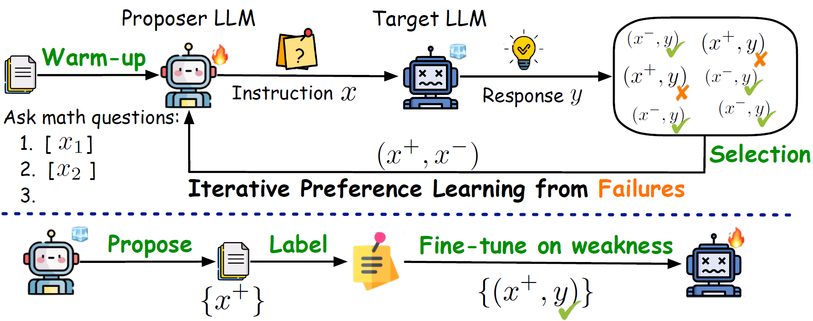

# Failure-inducing Data Synthesis (ReverseGen)
This repository contains the code and released models for our paper [Forewarned is Forearmed: Leveraging LLMs for Data Synthesis through Failure-Inducing Exploration](https://arxiv.org/abs/). 
We propose a new paradigm for generating effective synthetic data from the "failure" cases of a target model on specific tasks.
This approach effectively investigates the target model's weaknesses without the need for human annotation, transforming the task of exploring effective training data tailored to specific models and tasks into a trainable framework centered around failure-inducing exploration. 
We comprehensively evaluate ReverseGen in scenarios such as safety red-teaming, honesty calibration, and mathematical reasoning. Experimental results indicate that ReverseGen can identify a wide range of test samples where target models may fail.

</img>
